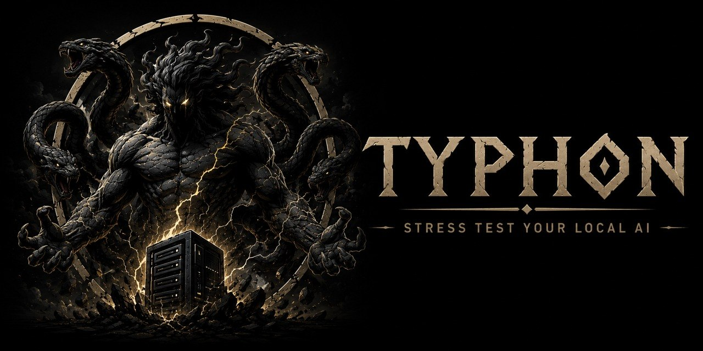

<div align="center">
  
  <br/><br/>

  <strong>In the age before order, when the gods themselves trembled, there was Typhon —<br/>the last great monster, father of storms, destroyer of certainty.<br/>He did not ask whether the mountain could withstand him. He simply pushed.</strong>

  <br/><br/>

  [](LICENSE)
  [](https://www.python.org)
  []()
  [](CONTRIBUTING.md)
  [](https://iacriolla.github.io/typhon-stress-test)
</div>

<br/>

**Your GPU deserves the same treatment.** Typhon detects your hardware, runs a tailored benchmark suite, generates an interactive dashboard, and consults an LLM to recommend the optimal configuration for your setup — so you know exactly what your machine can take before it matters.

**[→ Full documentation](https://iacriolla.github.io/typhon-stress-test)**

---

## The trial

```bash
git clone https://github.com/IAcriolla/typhon-stress-test.git
cd typhon-stress-test
pip install -e .
```

Start your LLM server, then face the storm:

```bash
typhon-scan    # survey the battlefield — hardware and running servers
typhon-run     # unleash the storm — benchmark → chronicle → dashboard
```

For subsequent runs:

```bash
typhon-run --quick    # a skirmish — ~3–5 min
typhon-run --full     # the full storm — ~15–20 min (default)
```

---

## The weapons

### `typhon-scan`

Before any storm, walk the terrain. Detects GPU (name, VRAM, driver), CPU, RAM, and any running LLM servers on their default ports — all port probes run in parallel, so the survey completes in ~2 seconds. Saves everything to `data/hardware_profile.json`.

### `typhon-run`

This is where the storm begins. Three waves, one command:

```
typhon-run [--quick | --full]
```

| Flag | Description |
|------|-------------|
| `--quick` | A skirmish — fewer context sizes, fewer runs. ~3–5 min. |
| `--full` | The complete trial including memory wall detection. ~15–20 min. Default. |

The test plan adapts to your VRAM. A 24 GB card faces up to 65,536 token context; an 8 GB card faces up to 16,384.

| Trial | What it hunts |
|-------|--------------|
| `baseline` | Peak TPS with a short prompt — your hardware ceiling before any pressure |
| `context_sweep` | TPS and VRAM at each context step — maps the degradation curve |
| `stress` | TPS during a long generation — finds whether throughput collapses over time |
| `memory_wall` | Where VRAM is exhausted and performance breaks (full mode only) |

First inference per test is discarded — cold-cache results corrupt the averages. GPU stats (VRAM, temperature, power) are captured per-benchmark, not as a run-wide blur.

### `typhon-dashboard`

Reforges the dashboard from the last run and opens it in your browser. A single self-contained `.html` file — no server, no internet required.

```bash
typhon-dashboard [--no-open]
```

### `typhon-summary`

Inscribes the findings into a Markdown chronicle at `data/typhon-summary-<timestamp>.md`. Hardware profile, per-context TPS/VRAM/temperature, key findings, and a suggested server configuration built from what was actually measured — not assumed.

```bash
typhon-summary
```

### `typhon-ask`

Consult the oracle. Sends your benchmark results to any LLM and streams back personalized recommendations — optimal `--ctx-size`, suggested launch flags, and an interpretation of what the data shows.

```bash
typhon-ask
```

Works with any OpenAI-compatible endpoint. By default speaks to the same local server that was just benchmarked — no API key, no ceremony.

```bash
# Local server (default — no configuration needed)
typhon-ask

# Ollama
TYPHON_LLM_URL=http://localhost:11434 TYPHON_LLM_MODEL=llama3 typhon-ask

# OpenAI
TYPHON_LLM_URL=https://api.openai.com/v1 TYPHON_LLM_KEY=sk-... TYPHON_LLM_MODEL=gpt-4o typhon-ask
```

### `typhon-export`

Offer your battle data to the community. Strips all personal information from `data/chronicle.jsonl` and writes a sanitized export. See [CONTRIBUTING.md](CONTRIBUTING.md) for how to submit it.

| Carried | Left behind |
|---------|-------------|
| GPU name, VRAM, vendor | File paths |
| CPU core count | Username / hostname |
| Total system RAM | IP addresses |
| Model filename (path stripped) | OS version |
| Benchmark metrics (TPS, VRAM, temp, latency) | |
| Machine ID (one-way hardware hash) | |

### `typhon-api`

Open the gates. Starts a REST API server for agent integration and remote automation. Benchmark jobs run in the background — dispatch a herald and poll for results without blocking.

```bash
typhon-api [--host HOST] [--port PORT]
```

```bash
# Open the gates
typhon-api

# Get current state instantly (no LLM, structured JSON)
curl -s "http://localhost:8000/report" | jq '{model, baseline_tps, suggested_ctx_size}'

# Dispatch a benchmark herald (returns immediately)
curl -s -X POST "http://localhost:8000/jobs/run?mode=quick"
# {"job_id": "a3f1c820", "status": "pending", "mode": "quick"}

# Track the storm's progress
curl -s "http://localhost:8000/jobs/a3f1c820" | jq '{status, progress}'

# Consult the oracle
curl -s "http://localhost:8000/ask"
```

Interactive API docs at `http://localhost:8000/docs`. See [AGENTS.md](AGENTS.md) for the full agent integration guide.

### `typhon-zeus`

> *In the old myths, Typhon was the only creature who ever made Zeus run.*

Extreme context stress test at 128K (131,072) and 256K (262,144) tokens. At these sizes, prefill time is everything — Zeus measures how long your server takes to swallow a million characters before generating a single word.

```bash
typhon-zeus          # face both 128K and 256K
typhon-zeus --128k   # 128K only
```

**Requires your server to be started with `--ctx-size 262144`.** Each test has a 10-minute timeout. You will be asked to confirm before anything begins.

*Terrible things could happen. Save everything you need before it's too late.*

---

## Supported servers

Typhon knocks on six doors automatically:

| Server | Port | Notes |
|--------|------|-------|
| llama.cpp (`llama-server`) | 8080 | Recommended |
| Ollama | 11434 | |
| LM Studio | 1234 | |
| vLLM | 8000 | |
| text-generation-webui | 5000 | Requires OpenAI extension |
| Jan | 1337 | |

**Arming llama-server:**

```bash
./llama-server \
  --model /path/to/model.gguf \
  --port 8080 \
  --flash-attn on \
  --ctx-size 32768 \
  -ngl 99
```

| Flag | Effect |
|------|--------|
| `--flash-attn on` | Reduces VRAM and improves TPS on large contexts. Always enable. |
| `--ctx-size N` | Maximum context in tokens. Set this to what `typhon-ask` recommends. |
| `-ngl 99` | Offload all layers to GPU. Required for honest benchmarks. |

---

## Project layout

```
typhon-stress-test/
├── typhon/
│   ├── cli.py                  # Entry points for all commands
│   ├── scanner.py              # Hardware and LLM server detection
│   ├── engine.py               # Adaptive benchmark engine
│   ├── scribe.py               # Chronicle dataset management
│   ├── advisor.py              # LLM-powered recommendations
│   ├── summarizer.py           # Markdown chronicle generation
│   ├── zeus.py                 # Extreme context stress tests
│   ├── dashboard_generator.py  # Self-contained HTML dashboard
│   └── exporter.py             # Anonymized community export
├── typhon_api/
│   └── server.py               # FastAPI REST server (the herald gates)
├── docs/                       # MkDocs documentation source
├── data/                       # Runtime data — gitignored
├── community_data/             # Community battle data
├── assets/
├── AGENTS.md                   # Agent integration guide
└── pyproject.toml
```

---

## Agent integration

See [AGENTS.md](AGENTS.md) for the complete guide. The short path:

```
GET /report          → check if data exists (instant)
POST /jobs/run       → dispatch the storm if not
GET /jobs/{job_id}   → poll until done
GET /ask             → consult the oracle
```

---

## Contributing

Run `typhon-export` and open a PR to `community_data/`. Every GPU and model combination makes the shared chronicle stronger. Code contributions welcome — open an issue first for anything substantial. See [CONTRIBUTING.md](CONTRIBUTING.md).

## License

[MIT](LICENSE)
